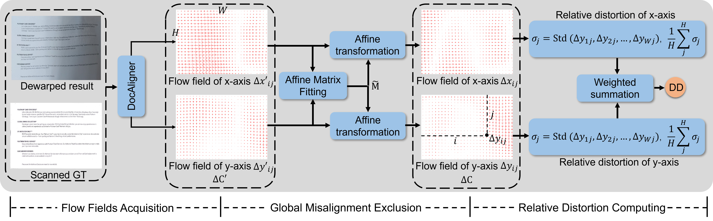

<div align=center>

# Enhancing Document Dewarping Evaluation: A New Metric with Improved Accuracy and Efficiency


</div>

<p align="center">
  
</p>


## Environment
The required environment is the same as that for [DocAligner](https://github.com/ZZZHANG-jx/DocAligner).
```
conda env create -f environment.yml
```
The correlation layer is implemented in CUDA using CuPy, so CuPy is a required dependency. It can be installed using pip install cupy or alternatively using one of the provided binary packages as outlined in the CuPy repository. The code was developed using Python 3.7 & PyTorch 1.11 & CUDA 11.2, which is why I installed cupy for cuda112. For another CUDA version, change accordingly.
```
pip install cupy-cuda112 --no-cache-dir
``` 

## Usage
1. Weight preparation:
    * Put hierarchical alignment module weights [docaligner.pkl](https://1drv.ms/f/s!Ak15mSdV3Wy4ibRvLXIMbJoIzkpSpQ?e=mkiGBp) to `checkpoint/`

2. Evaluation
```
python deomo.py
```

Based on the provided demo sample, the expected dd value should be: 11.049672614844578


## Citation
If you are using our code and data, please consider citing our paper.
```
@article{zhang2024enhancing,
title={Enhancing Document Dewarping Evaluation: A New Metric with Improved Accuracy and Efficiency},
author={Zhang, Jiaxin and Zhang, Peirong and Peng, Dezhi and Xu, Haowei and Jin, Lianwen},
journal={Pattern Recognition Letters}
year={2025}}
```


## ⭐ Star Rising
[](https://star-history.com/#ZZZHANG-jx/DocAligner-Distortion&Timeline)
